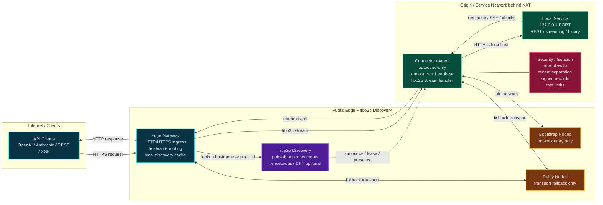

# Architecture

## Goal

Build a flat, libp2p-native API tunneling fabric where the only required runtime processes are:

- **Edge Gateway** on the client/public side
- **Connector / Agent** near the origin service

There is **no control plane for registering services or APIs**. Discovery is distributed and handled by libp2p primitives such as **pubsub**, with **rendezvous / DHT / relay** used only as supporting infrastructure.

---

## High-level architecture

---

## Components

### 1) Edge Gateway
Internet-facing HTTP/HTTPS reverse proxy that:

- accepts client requests
- resolves `hostname -> connector peer`
- keeps a local discovery cache
- enforces edge auth / rate limiting / audit logging
- forwards the request over a libp2p stream
- preserves HTTP method, path, query, headers, status, and body semantics

### 2) Connector / Agent
Runs next to the origin service and:

- establishes outbound libp2p connections only
- publishes signed presence announcements on pubsub
- renews heartbeats / leases
- receives libp2p streams from the edge
- forwards requests to the local service on `localhost` or unix socket
- streams responses back to the edge

### 3) libp2p Discovery Layer
Distributed discovery using:

- **pubsub** as the primary mechanism
- **rendezvous** and **DHT** as optional accelerators
- **relay** only when direct connectivity fails

This layer does **not** store authoritative service metadata in a centralized registry.

### 4) Bootstrap Nodes
Used only for network entry and peer discovery bootstrap.

### 5) Relay Nodes
Used only as transport fallback when hole punching / direct dial is not available.

### 6) Security and Isolation
Enforces:

- signed announcements
- tenant isolation
- peer allowlists in private networks
- expiration / lease-based validity
- rate limiting and abuse controls

---

## Connectivity model

Preferred path:

1. Edge learns a service peer from pubsub / cache / rendezvous.
2. Edge attempts a direct libp2p dial.
3. If necessary, libp2p hole punching is attempted.
4. Relay is used only as a fallback transport.

Important: **relay must never be the source of truth for service discovery**.

---

## Discovery and presence

The connector publishes ephemeral signed records such as:

- tenant / namespace
- supported hostnames
- peer ID
- capabilities
- expiry / lease timestamp
- local target description

The edge consumes these records and stores them in a local cache with TTL.

Recommended rules:

- short lease duration
- signed announcements
- sequence number or monotonic version field
- local eviction after expiry
- reject mismatched identity / hostname bindings

---

## Request lifecycle

1. Client sends HTTP request to the edge.
2. Edge resolves the target connector using local cache and libp2p discovery.
3. Edge opens a libp2p stream to the connector.
4. Edge serializes request metadata into the tunnel protocol.
5. Connector forwards the request to the local upstream service.
6. Connector streams the response back.
7. Edge reconstructs the HTTP response and returns it to the client.

Streaming requirements:

- support chunked transfer
- support SSE / token streaming
- avoid full buffering where possible
- preserve backpressure where feasible

---

## Public vs private network

### Public network
- open discovery via pubsub
- peer signatures required
- optional edge-side allowlists
- bootstrap nodes may be public
- relay nodes may be shared

### Private network
- dedicated swarm / namespace
- optional PSK
- private bootstrap nodes
- stricter peer allowlists
- stronger tenant isolation

In both modes, **there is still no service registry control plane**.

---

## Design constraints

- no inbound ports on the origin side
- no mandatory control plane for service registration
- preserve HTTP semantics for generic APIs
- support streaming and long-lived responses
- keep discovery distributed and temporary
- keep relay optional
- keep the MVP simple enough to operate self-hosted

---

## Non-goals for MVP

- browser-native libp2p clients
- WebSocket support before HTTP streaming is stable
- distributed consensus for service metadata
- strong global consistency for discovery
- multi-region edge orchestration

---

## MVP summary

The MVP consists of:

- **Edge Gateway**
- **Connector / Agent**
- **libp2p pubsub discovery**
- **relay fallback**
- **HTTP forwarding with streaming support**

That is enough to tunnel generic API traffic behind NAT without any central service registry.
