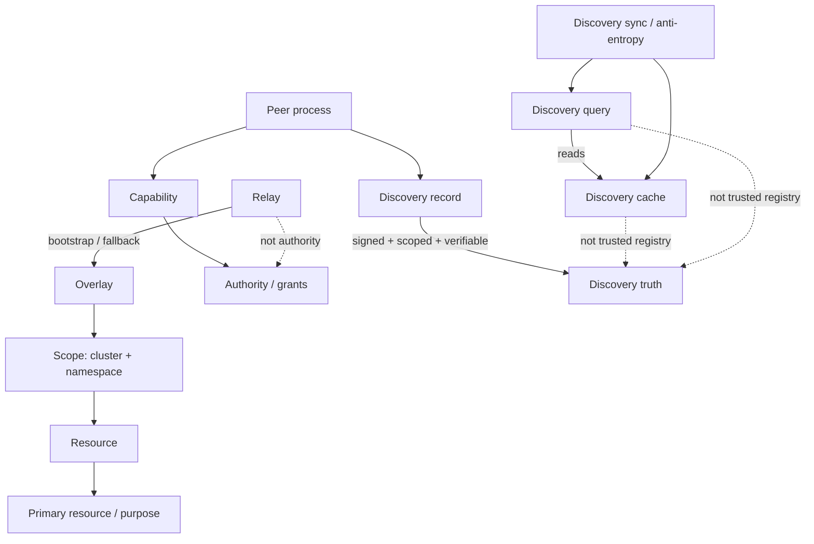

# Capability-based processes (#293)

This note defines the mental model Tubo should use for processes, resources, and discovery.
It is deliberately short and conceptual: it does not change CLI behavior or implementation.

## Core idea

A Tubo process exists for a specific primary resource inside a specific scope, and it carries the minimum capability needed to do its job.

Rules:

- capability != authority
- process name identifies why a process exists
- capabilities describe what a process can do
- cache/query/sync peers are not trusted registries
- discovery truth comes from signed, scoped, verifiable records

## Terms

### Overlay
The Tubo overlay is the private mesh of peers that can exchange discovery, grants, and tunnel traffic.
It is the shared transport plane, not the source of truth.

### Scope
Scope is always `cluster + namespace`.
Every durable resource, capability, and discovery record must be interpreted inside that scope.

### Peer process
A peer process is a running Tubo instance with a reason for existing:
service runtime, pipe runtime, discovery/cache helper, grants authority, relay/bootstrap node, and so on.
The name should communicate purpose, not just identity.

### Primary resource / purpose
Each process centers on one primary resource.
Examples:

- `svc-lms-7f3a` -> primary resource `service/lms`
- `pip-lms-0b82` -> primary resource `pipe/lms`
- `dsc-home-default-44ef` -> discovery/cache-only purpose

The primary resource is the thing the process is responsible for. The process name should make that reason obvious.

### Capability
A capability is a bounded permission to act on a resource in a scope.
It says what a process may do, not why it exists, and not whether it is authoritative.

### Authority / grants
Authority issues or verifies signed grants.
Grants are the control-plane statements that create or delegate capabilities.
A process may hold a capability, but it does not become authority just because it can use one.

### Resource
A resource is a scoped object with stable meaning: service, pipe, discovery record, grant, or similar.
Resources are not the same as processes.
Processes act on resources; they are not the resources themselves.

### Discovery record
A discovery record is a signed, scoped, verifiable statement about a resource.
It is the unit of truth that can be checked independently.

### Discovery cache
A discovery cache stores previously seen records for fast lookup.
It is useful, but it is not a registry of truth.

### Discovery query
A discovery query asks peers for records.
It is a read path, not an authority path.

### Discovery sync / anti-entropy
Discovery sync is the background process that reconciles caches and peers.
It improves freshness and convergence, but it does not grant trust by itself.

### Relay
Relay is bootstrap and fallback infrastructure.
It helps peers meet and recover connectivity, but it is not an authority for identity, scope, or truth.

## Ontology

## Mental model

Think of Tubo as a scope-bound overlay of peer processes.
Each process has a purpose, a primary resource, and a limited capability.
Authority lives in signed grants and verifiable records.
Discovery caches and discovery peers help the system converge, but they never become the source of truth on their own.

This keeps the model simple:

- the name tells you why the process exists;
- the capability tells you what it can do;
- the signed record tells you what is true;
- the scope tells you where that truth applies;
- the relay only helps you reach the overlay when direct paths are not available.

## CLI as UX presets

CLI commands are convenience presets over the same model:

- `tubo relay` -> bootstrap/fallback overlay transport
- `tubo gateway` -> a purpose-built process with gateway capabilities
- `tubo attach ...` -> service/process preset
- `tubo connect ...` -> pipe/process preset
- `tubo get|describe|inspect|watch ...` -> read-only views over scoped resources and runtime state
- `tubo ps|logs|stop|rm ...` -> process lifecycle UX, not a different authority model

The CLI should stay expressive, but it should not redefine the ontology.

## Design intent

This document is the conceptual base for later work on capability-based processes and discovery.
It is meant to keep naming, identity, authority, and discovery aligned while preserving Tubo’s current CLI surface.
